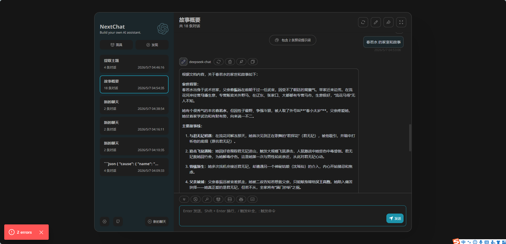

# SubQ

[中文](./README_cn.md)

A collection of long-context and intelligent Q&A projects.

---

## Projects

### 1. File-Chat — Long-Document Intelligent Q&A System

[](https://go.dev/)
[]()

A Go-based long-text intelligent Q&A system using **Context Engineering** with DeepSeek LLM. Provides an OpenAI-compatible API for seamless integration with chat frontends like NextChat.

**Key Features:**
- LLM-based semantic chunking — auto-splits long documents into meaningful chunks with summaries
- Two-level retrieval: file summaries → chunk outlines → top-K chunks
- `@path` to reference specific files, `@全部`/`@all` to search all indexed files
- Global file index — all conversations share global outline and summary, `@all` works across conversations
- File change detection (size → modTime → MD5 hash) avoids reprocessing
- File locking for concurrent-safe processing
- Parallel processing: 20 concurrent goroutines, 30KB segments per worker
- SSE streaming via OpenAI-compatible `/v1/chat/completions` API
- Supports PDF, Excel, Word, etc. via markitdown conversion

**Architecture:**
```
NextChat ──HTTP/SSE──▶ file-chat (Go) ──HTTP/SSE──▶ DeepSeek API
                            │
                            ├── Global file index (cross-conversation)
                            ├── LLM semantic chunking (parallel 20 workers)
                            ├── Hash-based file storage (deduplication)
                            └── markitdown document conversion
```

**Data Storage:**
```
data/
├── files.json                    # Global file registry
├── files/{hash[:2]}/{hash[2:4]}/{name}/
│   ├── outline                   # Per-file outline
│   ├── source                    # Converted text
│   └── chunks/                   # Chunk files
├── chats/{conversationID}/
│   └── chat-files.json           # Per-conversation file list
└── global/
    ├── global_outline            # Global outline (all files)
    └── global_files_summary.xml  # Global file summaries
```

**Quick Start:**
```bash
# Install markitdown
pip install markitdown

# Build
cd file-chat && go build -o file-chat

# Configure API key and run
set DEEPSEEK_API_KEY=your-key-here
file-chat.exe

# Deploy NextChat, set API endpoint to http://localhost:8880
```

See [Architecture](./wiki2/Architecture-file-chat.md) and [PRD](./wiki2/PRD-file-chat.md) for details.

**Usage (NextChat):**
1. Start backend: double-click `file-chat/start-with-key-pan.bat`
2. Start NextChat: double-click `scripts/start-nextchat.bat`
3. Open http://localhost:3000, go to Settings:
   - Custom API endpoint: `http://localhost:8880`
   - API Key: your DeepSeek API Key
   - Model: `deepseek-v4-flash`, select **deepseek-chat** as provider
4. New chat, type `@absolute\path\to\file.txt` + your question, send

**Screenshot:**



---

### 2. CRBSA — Codebook-Routed Block-Sparse Attention

[](https://opensource.org/licenses/MIT)
[](https://www.python.org/downloads/)
[](https://pytorch.org/)
[]()

**CRBSA (Codebook-Routed Block-Sparse Attention)** is a long-context attention architecture that makes 1M–10M token inference practical by replacing $O(N^2)$ routing with a fixed **Global Semantic Codebook**.

Each query routes to only $O(M)$ codebook entries ($M=1024$, a constant), then receives **exact** FlashAttention on the selected blocks — zero information blur, no RNN hidden states, no approximations.

## Why CRBSA

| | Dense Attn | DeepSeek V4 | Linear RNN | **CRBSA** |
|:---|:---|:---|:---|:---|
| **Complexity** | $O(N^2)$ | $O((N/m)^2)$ | $O(N)$ | **$O(N)$** |
| **1M Prefill Speedup** | 1× | ~10× | ~8× | **>50×** |
| **Recency Bias** | None | Low | High | **None** |
| **Multi-hop Retrieval** | Excellent | Good | Poor | **Excellent** |

## Architecture

```
Input ──▶ Q/K/V Proj ──▶ Block Summarize ──▶ Codebook Inverted Index
                                       │              │
                                       │    Query × Codebook (O(M))
                                       │              │
                                       ▼              ▼
                                 Local Window  +  Routed Blocks
                                              │
                                   Triton Block-Sparse FlashAttn
                                              │
                                           Output
```

Four steps, all parallelizable:
1. **Block Summarization** — chunk into $B=128$, mean-pool keys → summaries
2. **Codebook Indexing** — assign each block to one of $M=1024$ learnable semantic clusters
3. **$O(1)$ Query Routing** — query scores against codebook, top-$K$ cluster → block IDs
4. **Exact Sparse Attention** — Triton/Flex/Dense kernel on selected blocks only

## Quick Start

### Install

```bash
git clone https://github.com/your-org/CRBSA.git
cd CRBSA
pip install -e .
```

### Verify Modules

```bash
# Test all modules without loading a model
python scripts/verify.py --seq-len 2048 --debug

# Full model test (needs GPU)
python scripts/verify.py --model Qwen/Qwen3.6-35B-A3B --seq-len 4096 --debug
```

### Inference

```python
import torch
from crbsa.config import CRBSAConfig
from crbsa.models import apply_crbsa_to_qwen3

# Configure
config = CRBSAConfig.from_pretrained("Qwen/Qwen3.6-35B-A3B")
config.block_size = 128
config.codebook_size = 1024
config.max_routed_blocks = 6

# Load model with CRBSA attention
model = apply_crbsa_to_qwen3("Qwen/Qwen3.6-35B-A3B", config)
model.eval()

# Forward with long context
input_ids = torch.randint(0, config.vocab_size, (1, 100000)).cuda()
result = model(input_ids=input_ids)
print(result["logits"].shape)
```

### Debug Mode

All debug switches are in `CRBSAConfig`. Zero overhead when disabled.

```python
config = CRBSAConfig(
    debug_enabled=True,            # master switch
    debug_log_routing=True,        # top-K codebook IDs, scores
    debug_log_block_assignment=True,  # codebook distribution, entropy
    debug_check_numerics=True,     # NaN/Inf detection
    debug_profile_kernel=True,     # per-step timing
    debug_save_intermediates=True, # save tensors to disk
)
```

## Training Pipeline

Three-stage pipeline to avoid index collapse (`scripts/train/`):

**Stage 1 — Router Distillation** (`stage1_distill.py`)

Freeze backbone, train codebook router with dense attention ground truth.

```bash
python scripts/train/stage1_distill.py \
    --model Qwen/Qwen3.6-35B-A3B \
    --seq-len 131072 --epochs 3 --debug
```

**Stage 2 — Detached Sparse Tuning** (`stage2_sft.py`)

Unfreeze all. Route sparse, but **detach** router gradients from LM loss.

```bash
python scripts/train/stage2_sft.py \
    --model Qwen/Qwen3.6-35B-A3B \
    --stage1-dir outputs/stage1 --epochs 2 --debug
```

**Stage 3 — GRPO RL** (`stage3_grpo.py`)

RL rewards for successful long-range retrieval on NIAH/SWE-bench tasks.

```bash
python scripts/train/stage3_grpo.py \
    --model Qwen/Qwen3.6-35B-A3B --debug
```

Or all at once:

```bash
bash scripts/train/run_all.sh
```

## Evaluation

```bash
# NIAH: needle-in-a-haystack at various lengths and depths
python scripts/eval/eval_niah.py --model Qwen/Qwen3.6-35B-A3B --debug

# Routing accuracy vs dense attention ground truth
python scripts/eval/eval_routing.py --seq-len 32768 --debug

# Kernel benchmark: CRBSA vs Dense at different seq lengths
python scripts/eval/benchmark_kernel.py --seq-lengths 2048 4096 8192 16384
```

## Project Structure

```
crbsa/
├── config.py                  # CRBSAConfig — all hyperparams + debug switches
├── debug.py                   # DebugContext / DebugCollector / CRBSAProfiler
├── nn/
│   ├── block_summarizer.py    # Step 1: block summary (pool → project)
│   ├── codebook_router.py     # Step 2+3: inverted index + query routing
│   ├── sparse_attention.py    # Step 4: Triton / Flex / Dense backends
│   └── crbsa_layer.py         # Full layer: 4-step pipeline + RoPE + detach
├── kernels/
│   └── block_sparse_attn.py   # Triton kernel + fallback implementations
├── models/
│   └── qwen_crbsa.py          # Qwen3.6-35B-A3B (MoE) adapter
├── utils/
│   ├── distributed.py         # Ulysses sequence parallel + P2P KV fetch
│   └── profiling.py           # BenchmarkResult + VRAM measurement
scripts/
├── verify.py                  # Quick module + model verification
├── train/                     # 3-stage training scripts + run_all.sh
└── eval/                      # NIAH, routing accuracy, kernel benchmark
wiki/
├── Architecture.md            # Full architecture document
└── Code-Design.md             # Code design + debug roadmap
```

## Supported Models

CRBSA is designed for and tested with **Qwen3.6-35B-A3B** (MoE, 35B total / 3B active). The adapter preserves MoE MLP layers and only replaces attention layers.

The architecture is general and can be adapted to any Transformer model with GQA.

## Key Parameters

| Parameter | Default | Description |
|:---|:---|:---|
| `block_size` | 128 | Tokens per block (matches Triton optimal throughput) |
| `codebook_size` | 1024 | Number of semantic clusters |
| `route_dim` | 64 | Router projection dimension |
| `topk_codebooks` | 4 | Codebook clusters per query |
| `max_routed_blocks` | 6 | Max remote blocks per query |
| `local_blocks` | 2 | Local sliding window blocks |
| `route_temperature` | 1.0 | Softmax temperature for codebook selection |

## License

MIT
